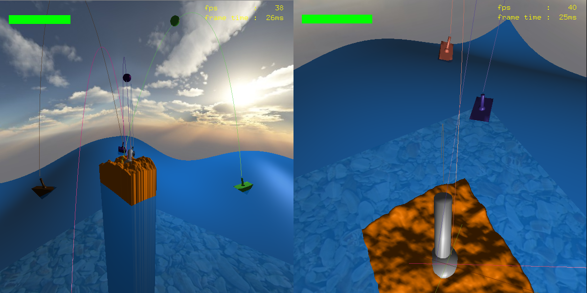

# IslandDefense-3D
C++ - School project - OpenGL/GLUT 3D game.

Includes bonus mouse controls, perlin noise generated island and skybox.

## Visuals

## Controls

### Camera
|  Key   |   Action    |
| ------ | ----------- |
| a | left |
| d | right |
| w | forward |
| s | backward |
| A | left (speed) |
| D | right (speed) |
| W | forward (speed) |
| S | backward (speed) |

### Waves
|  Key   |   Action    |
| ------ | ----------- |
| p | toggle animations |
| + | double vertices |
| - | halve segments |

### Island
|  Key   |   Action    |
| ------ | ----------- |
| e | increase cannon speed |
| r | decrease cannon speed |
| g | fire |
| b | defend |
| h | change cannon direction (increase rotation) |
| H | change cannon direction (decrease rotation) |
| mouse clic | fire |

### Graphical Commands
|  Key   |   Action    |
| ------ | ----------- |
| n | toggle normals |
| t | toggle tangeants |
| i | toggle wireframe |
| l | show light |

### General
|  Key   |   Action    |
| ------ | ----------- |
| esc | Quit |